# WARNING | THIS IS A WORK IN PROGRESS! 

This proyect is barely tested.

Link to test video:  

# ESP8266 Plane

Sorry for my english, i'm learning.

## The Idea

The idea is a simple wifi plane, controlled whit a Phone using a Touch Screen or a Bluetooth Joystick and a ESP8266

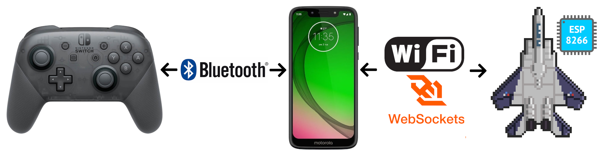

## Hardware

Controller Part List:

* Wemos D1 Mini
* Wemos Motor Shield
* Wemos Battery Shield
* 100k resitor
* 500 mAh 1c 3.7v lipo battery  
* Phone or PC 
* Bluetooth Joystick (im using a Swich Pro Controller)
* USB to USB Micro Cable (charging and upload the program)
* Cable and conectors.

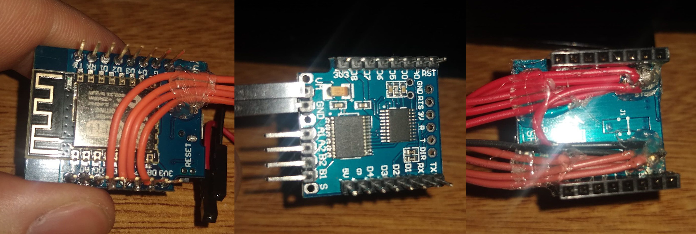
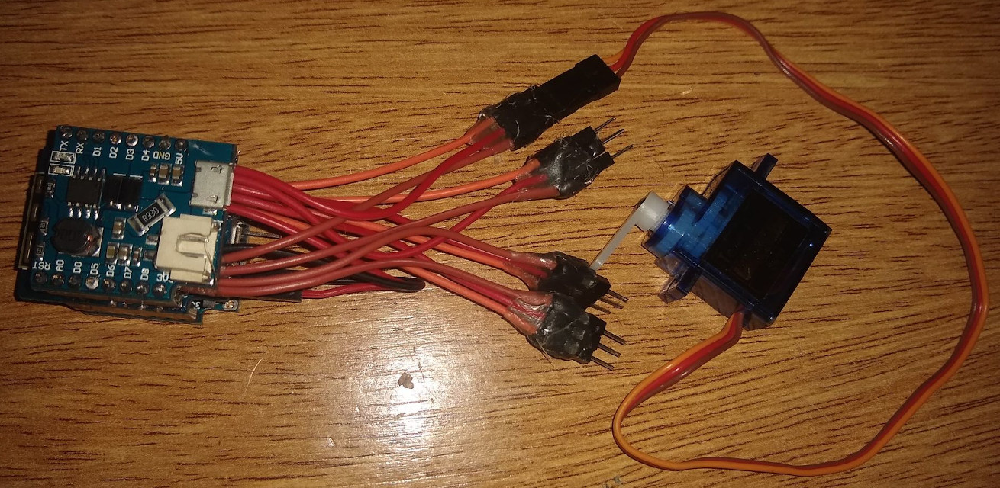

Plane Part List:

* 2mm Foamboard
* 1mm Balsa wood
* 2 Small servos
* 2 Small plane motors
* 2 Rubber Bands (for the wing)
* 2 bamboo sticks or 2 brochete sticks or 4 toothpicks  
* Steel Wire

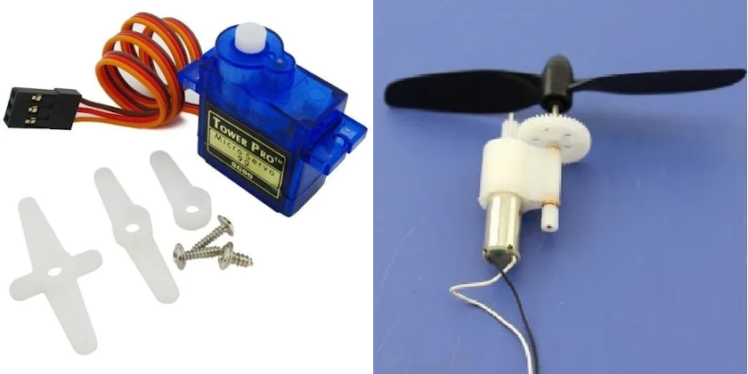

Tools list:

* Soldering Iron and lead
* Hot Glue Gun and Sticks
* Cutter
* Superglue

## Diagram
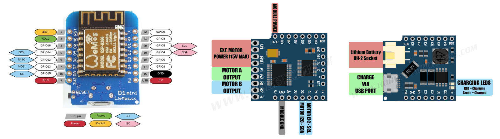
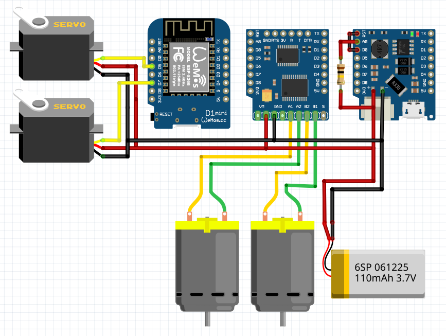

**Wemos Motor Shield**

Wemos Motor Shield V2 dont need changes.  

Wemos Motor Shield V1 needs soldering.

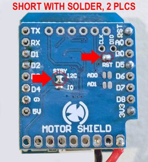  

Also, you need improve stability flashing new firmware, for dat you need a USB TTL Programer, and connect the motor shield to a PC

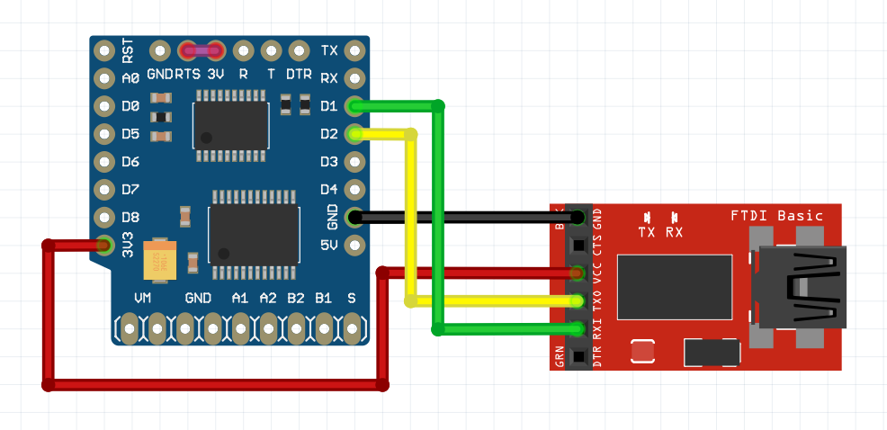  

Then you need execute the flash commands for linux

        cd /tmp
        sudo apt install stm32flash
        wget https://cdn.hackaday.io/files/18439788894176/motor_shield.bin
        stm32flash /dev/ttyUSB0
        stm32flash -k /dev/ttyUSB0
        stm32flash -f -v -w motor_shield.bin /dev/ttyUSB0

For mac or windows see [link](https://www.letscontrolit.com/wiki/index.php/WemosMotorshield)

## **Install Firmware to ESP8266**

1. Install CH340G Serial Driver - [Windows](https://www.instructables.com/id/Instalar-driver-para-CH340G/) - [Mac](https://kig.re/2014/12/31/how-to-use-arduino-nano-mini-pro-with-CH340G-on-mac-osx-yosemite.html) - Included in linux
2. Install Visual Studio Code - [Download](https://code.visualstudio.com/)
3. Install Plataform IO - [Instructions](https://platformio.org/install/ide?install=vscode)
4. Download Repository  
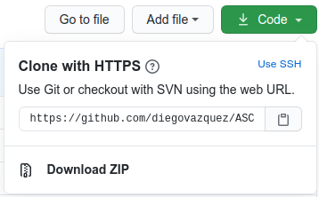
5. Copy configuration.example to src/configuration.h and set the wifi configuration (see firmware configuration)
6. Connect Wemos D1 Mini USB
7. Build and Upload the code  
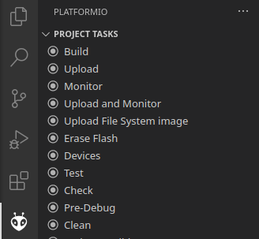

## Firmware Configuration

Edit src/configuration.h

**WIFI_MODE:** 
* JOIN: Join a existing Access Point
* AP: Create a password protected Access Point
* OPENAP: Create a open Access Point

**WIFI_NAME:** Name of the Wifi Network  
**WIFI_PASS:** Password of the Wifi Network (not used in OPENAP)

Example:

        #define WIFI_MODE           "AP"     
        #define WIFI_NAME           "PLANE"      
        #define WIFI_PASS           "12345678"  

## Control

The control is a Webpage, can go full screen and is resposibe.

Horizontal Control  
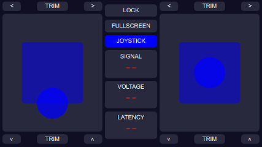 

Vertical Control  
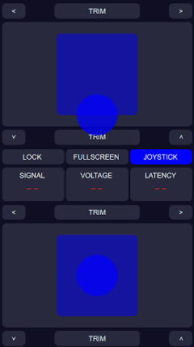

## Javascript Configuration

**GamePad Axis Feedback configuration**

        config.gamepadAxis12FeedbackStyle = 'PowerStick';   
        config.gamepadAxis34FeedbackStyle = 'Square';           

Options: Circular - Square - PowerStick

**Gamepad Trim buttoms Mapping:**

        config.gamepadPanel1TopTrimPlus = 'button_15'; 
        config.gamepadPanel1TopTrimMinus = 'button_14';  
        config.gamepadPanel1BottomTrimPlus = 'button_12';  
        config.gamepadPanel1BottomTrimMinus = 'button_13'; 
        config.gamepadPanel3TopTrimPlus = 'button_1';  
        config.gamepadPanel3TopTrimMinus = 'button_2';  
        config.gamepadPanel3BottomTrimPlus = 'button_3'; 
        config.gamepadPanel3BottomTrimMinus = 'button_0'; 

To test you gamepad buttons you can use this [link](
https://gamepad-tester.com/)

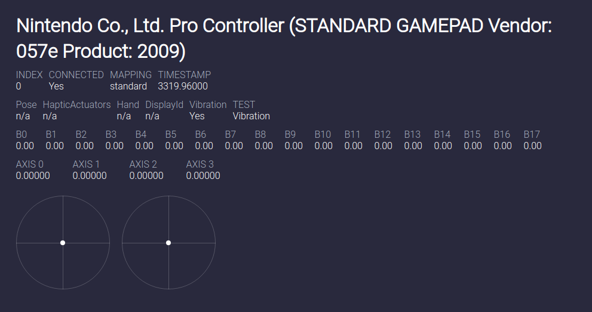

**Wifi Signal Telemetry Style:**

        config.telemetryWifiSignalStyle = 'Percentual';  

Options: Percentual - dBm   
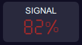
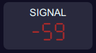

Links : [Wifi Singal Streng Explained](https://eyesaas.com/wi-fi-signal-strength/#:~:text=Wireless%20signal%20strength%20is%20measured,expressed%20only%20as%20negative%20values.&text=Maximum%20signal%20strength%2C%20you%20are,be%20considered%20excellent%20signal%20strength.)

# Libraries 

## Javascript

For joypad interaction [joypad.js](https://github.com/ArunMichaelDsouza/joypad.js) (MIT Licensed)  

For touchscreen controls [nipplejs](https://yoannmoi.net/nipplejs/) (MIT Licensed)  

## Arduino

For [WebSockets](https://github.com/Links2004/arduinoWebSockets) (GNU LGPL)

For [Json](https://github.com/bblanchon/ArduinoJson) (MIT Licensed)

For [WEMOS Motor Shield](https://github.com/wemos/WEMOS_Motor_Shield_Arduino_Library/tree/master/src)

# License

All libraries have his own license, my code and documentation is MIT Licensed.

